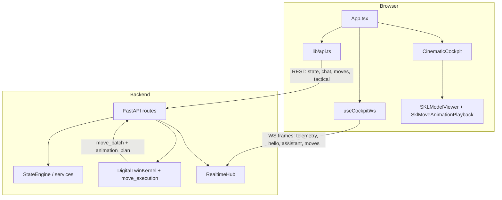

# Mazinkaiser AI

Immersive **software-only** AI mecha companion: conversational Kaiser Core, REST + WebSocket cockpit uplink, simulated twin telemetry, cinematic move demonstrations (`move_batch` + HUD cues), tactical snapshots, SKL hull viewport (Three.js / glTF), and a safety governor aligned with responsible-AI practice.

**This file is the single repository entry point.** Package-level blurbs that used to live only under `frontend/`, `backend/`, `tests/`, `infra/`, `scripts/`, and `assets/` are summarized below; those folders may still contain one-line pointers here.

**Canon & planning:** [System canon](docs/SYSTEM_CANON.md) · [Architecture](docs/ARCHITECTURE.md) · [**Doc index / collision guard**](docs/ENGINEERING_SOURCE_OF_TRUTH.md) · [**KPI catalog & weights**](docs/KPI_CATALOG_AND_WEIGHTS.md) · [Business requirements](docs/BRD.md) · [Technical specification](docs/TECH_SPEC.md) · [Phase 2 orchestration chain](docs/PROMPT_PIPELINE.md) · [Deployment](docs/DEPLOYMENT.md) · [Cinematic avatar / tiers](docs/CINEMATIC_AVATAR.md) · [API surface](docs/API.md) · [Testing strategy](docs/TESTING.md) · [Configuration](docs/CONFIGURATION.md)

**Package maps:** [`backend/STRUCTURE.md`](backend/STRUCTURE.md)

## Experience goal (frontend)

Mazinkaiser SKL AI is a **cinematic cockpit simulator**: the **SKL glTF hull** is the focal point—command, diagnostics, and twin telemetry stay **instrument-rated** (gauges, strips, drawers), not a dense data-dashboard grid. Full technical density lives in the **Diagnostics** drawer and SKL **Debug** settings tab. Product tone and avatar tiers: [`docs/CINEMATIC_AVATAR.md`](docs/CINEMATIC_AVATAR.md).

---

## Engineering standards alignment (conceptual)

Architecture and implementation choices are **mapped to** international quality, security, and AI governance references so telemetry, safety, typing, and observability stay coherent—not as paperwork, but as design pressure:

| Area | Reference | In this repository |
|------|-----------|---------------------|
| Software quality | ISO/IEC 25010 | Modular boundaries; typed contracts; resilient WebSocket parsing; maintainable cockpit modules |
| AI management | ISO/IEC 42001 | Trace IDs on assistant streams; governance-oriented TypeScript types (`AIAuditEvent`, risk classification); simulation posture in domain code |
| Security management | ISO/IEC 27001, OWASP ASVS | Versioned REST; Pydantic on the server; Zod validation at browser ingress; deployment hardening per **`docs/DEPLOYMENT.md`** |
| Responsible AI | NIST AI RMF | Safety governor, audit logging, refusal flows in **`AIOrchestrator`** |
| Risk management | ISO 31000 | Explicit risk labels in shared types; “simulation-first” twin semantics |

**Authoritative serialization for `/api/v1` and `/ws/cockpit` remains Python (Pydantic).** The **`@mazinkaiser/shared-types`** package mirrors those contracts for the TypeScript client and validates inbound frames at the edge of the UI.

---

## Type system overview

| Item | Location |
|------|----------|
| **`@mazinkaiser/shared-types`** | `packages/shared-types` — Zod schemas; `SKLTelemetryState`, `CockpitRealtimeEvent`, `SKLMoveExecutionBatch`, viewer / governance / observability types |
| **WS ingress** | `frontend/src/hooks/useCockpitWs.ts`, `frontend/src/realtime/cockpitRealtime.ts` |
| **Trace store** | `frontend/src/stores/cockpitTraceStore.ts` (correlates WS `trace_id` with assistant frames) |
| **3D viewer ids** | `CameraMode` / lighting presets re-exported into **`SKLModelViewer`** from shared types where applicable |

Install from the **repository root** (`npm install`) so npm workspaces link `frontend` → `packages/shared-types` (see `frontend` **`package.json`** `file:../packages/shared-types`).

**Architecture detail:** AI governance, event layering, diagnostics, safety, viewer, and GLB pipeline are documented under **`docs/ARCHITECTURE.md`** (sections following **TypeScript client contracts**).

---

## How the pieces connect (reverse engineered)

Monorepo: **FastAPI backend** exposes versioned REST under `/api/v1` and a cockpit WebSocket (`/ws/cockpit`). **Vite/React frontend** renders the cinematic cockpit; in dev it **proxies** `/api` and `/ws` to the API on port **8000**, while the WebSocket client can connect **directly** to `ws://127.0.0.1:8000` in dev (see `frontend/src/config.ts`) to avoid proxy noise when the backend is down.



**Move → hull animation path:** executing a cockpit move yields a **`MoveBatchReport`** serialized as **`move_batch`** on `POST /api/v1/cockpit/move-demo` and on WS **`move_event`**. The `animation_plan` array is normalized in `App` (`normalizeAnimationPlan`), drives HUD/overlay timing, and is passed into **`SKLModelViewer`** as `SklMovePlaybackSnapshot`; **`SklMoveAnimationPlayback`** maps cue rows onto glTF **`AnimationClip`** names via `sklClipMapping`. If the shipped GLB has no matching clips, HUD state can still advance while the mesh stays visually idle (**asset/mapping gap**, not an API failure). See **`docs/ARCHITECTURE.md`** (Move batch → cockpit 3D).

**Presentation layer:** Avatar semantics (`COMBAT_READY`, move charging/executing, etc.) resolve through **`resolveAvatarPresentation`** (`frontend/src/avatar/presentation/`) so the cockpit shell, overlays, and SKL staging stay coherent.

---

## Repository layout

| Path | Role |
|------|------|
| `packages/shared-types` | **Workspace package** — `@mazinkaiser/shared-types`: Zod + TypeScript contracts (`SKLTelemetryState`, WS envelopes, move batch, governance stubs). Consumed by **`frontend/`**. |
| `backend/` | FastAPI (`mazinkaiser.main:app`), REST + WS, Kaiser Core orchestration, state engine, digital twin / move pipeline, safety, observability. Installable **`mazinkaiser`** package. **Cockpit contract:** `POST /api/v1/cockpit/move-demo` and WS move fan-out include **`move_batch.animation_plan`** — see **`backend/tests/test_cockpit_move_demo_contract.py`**. |
| `frontend/` | Vite + React 19 + TypeScript + Tailwind CSS v4 + Framer Motion. Cockpit, HUD, **R3F/Three SKL hull**, realtime client, voice (Web Speech API). |
| `docs/` | BRD, tech spec, API, architecture, **`PROMPT_PIPELINE.md`**, **`SYSTEM_CANON.md`**, digital twin / avatar notes. |
| `infra/` | Declarative stack: **`infra/docker-compose.yml`** = Postgres + Redis for local/future persistence. Root **`docker-compose.yml`** also orchestrates full-stack app images. |
| `scripts/` | Dev ergonomics: **`scripts/dev.ps1`** (Windows), **`scripts/dev.sh`** (Unix) — convenience; CI uses `uvicorn` / `npm run` directly. |
| `assets/` | Static brand / cockpit artwork (logos, reference HUD frames). Prefer SVG + small assets; use **Git LFS** for large binaries. |
| **`mazinkaiser_skl.glb`** *(repo root)* | Source glTF; **`frontend`** **`predev`** / **`prebuild`** copies into **`frontend/public/models/`** (`frontend/scripts/sync-mazinkaiser-skl-glb.mjs`). |
| `tests/` | Reserved for **cross-cutting** checks that should not live inside the backend package; primary Python suite is **`backend/tests/`**. |

---

## Frontend source map (`frontend/src`)

| Path | Role |
|------|------|
| `components/cockpit/` | Shell, command deck, layout chrome (**`CinematicCockpit`**) |
| `components/hud/` | Telemetry bars, tactical readouts |
| `avatar/` | `resolveAvatarPresentation`; **`view/SKLModelViewer`** (R3F + drei OrbitControls) ingests **`move_batch`**-driven **`SklMovePlaybackSnapshot`** |
| `hooks/` | `useCockpitWs` and other session hooks |
| `realtime/` | **`cockpitRealtime.ts`** — Zod-backed `extractHudPayload` + protocol helpers |
| `lib/` | HTTP client (`api.ts`), utilities |
| `state/` | UI/session state patterns |
| `voice/` | Web Speech API integration |
| `animations/` | Motion presets, transitions |
| `stores/` | **`cockpitTraceStore`** — assistant `trace_id` correlation (observability / governance seam) |
| `config.ts` | Build-time API base URL, cockpit WS helpers |

Nested topic READMEs under **`frontend/src/**/README.md`** (cockpit, HUD, voice, etc.) add local context; this table is the overview.

**Frontend commands:** from `frontend/` — `npm install` · `npm run dev` (http://localhost:5173, proxies `/api` + `/ws` to backend :8000) · `npm run build` · `npm run lint` · `npm test`. Prefer **`npm install` from the repo root** once so the **`@mazinkaiser/shared-types`** workspace package links correctly.

---

## Tests

| Location | Scope |
|----------|--------|
| **`backend/tests/`** | Primary **Python** suite: domain, safety, state engine, digital twin, move registry, API envelopes. Run from `backend/` with `pytest -q`. |
| **`tests/`** | Reserved for cross-cutting or future E2E manifests that should not live inside `mazinkaiser`. |

---

## Quick start

### Backend

```bash
cd backend
python -m venv .venv
.\.venv\Scripts\activate   # Windows — use `source .venv/bin/activate` on Unix
pip install -e ".[dev]"
copy .env.example .env     # optional OPENAI_API_KEY; stub responses work offline
uvicorn mazinkaiser.main:app --reload --host 0.0.0.0 --port 8000
```

Readiness: `GET http://127.0.0.1:8000/health/ready`

If **`WinError 10048`** / “address already in use” on port **8000**, stop the other process on that port or run uvicorn with **`--port 8001`** and align proxy/URLs.

### Frontend

```bash
cd frontend
copy .env.example .env       # optional; see Configuration below
npm install
npm run dev
```

Open **`http://localhost:5173`**. Prefer **`localhost`** for the browser origin in some environments; dev server proxies **`/api`** and **`/ws`** to **`http://127.0.0.1:8000`**.

### Full-stack Compose (optional)

Root **`docker-compose.yml`** wires **backend** + **frontend** (nginx terminates `/api` + `/ws`). See **`docs/DEPLOYMENT.md`**.

Infrastructure-only Postgres/Redis (future persistence):

```bash
docker compose -f infra/docker-compose.yml up -d
```

The MVP backend runs without those services.

---

## Configuration (high signal)

| Area | Variable | Notes |
|------|----------|------|
| Backend | `.env` from **`backend/.env.example`** | OpenAI-compatible API when key set; else local stub (`docs/CONFIGURATION.md`) |
| Frontend | **`VITE_API_BASE_URL`** | Empty → same-origin `/api`; set for explicit API host in production builds |
| Frontend | **`VITE_COCKPIT_DISABLE`** | `1` / `true` → skip WebSocket; hull/UI still loads for offline GLB work |
| Frontend | **`VITE_COCKPIT_WS_URL`** | Override cockpit WS URL; default dev uses **`ws://127.0.0.1:8000/ws/cockpit`** |

---

## Security & safety

Deterministic **safety governor** before LLM routing; **audit** JSON-lines trail (`AUDIT_LOG_PATH`). All combat and moves are **simulated / cinematic**; canon forbids real-world weaponization framing.

---

## Testing & CI

Locally (mirrors **`/.github/workflows/mazinkaiser-ci.yml`**):

```bash
cd backend && ruff check mazinkaiser tests && pytest -q
cd frontend && npm run lint && npm run build && npm test
```

Root **`npm test`** (`package.json` at repo root) delegates to **`frontend/`** only; backend tests live under **`backend/tests/`**. Contract coverage for cockpit **`move_batch`**: **`backend/tests/test_cockpit_move_demo_contract.py`**.

---

## License

Proprietary / project-local unless you add a LICENSE file.
