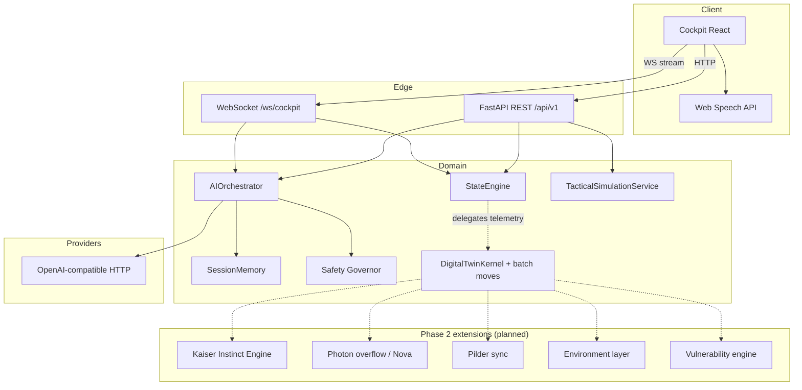

# Architecture

## Monorepo (`Mazinkaiser AI/`)

| Folder | Notes |
|--------|--------|
| **`frontend/`** | Vite + React + TypeScript cockpit; see **`frontend/README.md`**. |
| **`backend/`** | Installable `mazinkaiser` package — FastAPI async, Pydantic settings, versioned REST under `/api/v1`, centralized exception handlers + **`RequestContextMiddleware`**, WebSocket route. |
| **`docs/`** | Product + engineering truth: **BRD**, **TECH_SPEC**, API, testing, orchestration. |
| **`infra/`**, **`scripts/`**, **`assets/`** | Compose, dev scripts, static assets. |
| **`tests/`** | Top-level README for cross-cutting tests; default Python suite stays in **`backend/tests/`** (package-local). |

See also **`docs/TECH_SPEC.md`** and **`docs/BRD.md`**.

## Cinematic talking avatar (tiered roadmap)

The cockpit avatar is deliberately **tiered**: layered image (**MVP**), **Live2D Cubism** (anime 2.5D), and **cinematic 3D** (Audio2Face-class rigs + Three.js or Unreal Pixel Streaming). Mazinkaiser is a **mecha entity** — speech reads through **visor, reactor pulse, plating motion, glow,** and waveform/subtitles rather than generic human lips. Logical animation channels (`MechanicalSpeakRig`) and `deriveMechanicalSpeakSnapshot()` live under `frontend/src/avatar/presentation/`. Full pipeline, artifacts, and external references are in **`docs/CINEMATIC_AVATAR.md`**.

## Layers

1. **Presentation** — React cockpit (HUD, avatar placeholder, command deck, move grid).
2. **API** — FastAPI routers: health, cockpit REST, WebSocket session.
3. **Application** — `AIOrchestrator` composes safety, persona prompt, LLM, memory.
4. **Domain** — `MechaState`, `PersonalityMode`, `KaiserMove` (Pydantic models & enums).
5. **Simulation / digital twin** — `DigitalTwinKernel`, subsystem tick, **`move_execution`** batch registry (`docs/DIGITAL_TWIN.md`).
6. **Infrastructure** — HTTP client for LLM, file audit log, future Postgres/Redis.

## Orchestration discipline (Phase 2)

Incremental build order and mandated safety-for-refactors footer live in **`docs/PROMPT_PIPELINE.md`**. New engines (instinct, Nova reactor, Pilder, extreme environment modes, vulnerability analysis) MUST attach as **thin modules feeding the existing kernel/state projection**, not replacements for `MechaState` — extend models with optional fields / feature flags unless you intentionally version the API (`docs/API.md`).

## Runtime singletons

`mazinkaiser/runtime.py` holds process-wide `StateEngine`, `TacticalSimulationService`, and session `SessionMemory` maps. For horizontal scaling, replace with Redis session store and a shared simulation service.

## Observability

- **Structured logging** via `structlog` (`mazinkaiser/core/logging.py`); JSON in production.
- **Liveness/readiness** — `GET /health/live`, `GET /health/ready` (readiness includes a `checks` scaffold).
- **Correlation** — `X-Request-ID` on responses; JSON errors include **`request_id`** (`mazinkaiser.api.exception_handlers`).
- **Audit trail** — JSON lines for governance reviews.
- **Prometheus plaintext** — `GET /metrics` when **`EXPOSE_METRICS=true`** (`mazinkaiser/observability/metrics.py`).

## Future extension points

- **Vector memory** — swap `SessionMemory` backing store; add embedding pipeline.
- **Whisper / streaming TTS** — voice gateway service behind stable interfaces.
- **Cubism / cinematic 3D avatar** — tiered presenters + **`MechanicalSpeakRig`** via `deriveMechanicalSpeakSnapshot`; see **`docs/CINEMATIC_AVATAR.md`** and `AvatarPresentationHost` kind `'unreal_stream'`.
- **Unity / Unreal / ROS2** — narrow bridge ports under `mazinkaiser/bridges/` and event buses (NATS, Redis streams) feeding telemetry topics; keep adapters out of the cognition hot path.
- **Phase 2 systems** — see **`docs/PROMPT_PIPELINE.md`**: Kaiser Instinct, Photon overflow/Nova reactor, Pilder sync, environment layer (`SPACE`, `VOLCANIC`, `OCEANIC`, `URBAN`, `ATMOSPHERIC`, `UNDERGROUND`), Strategic Vulnerability Engine; lore references on [Mazinger Wiki](https://mazinger.fandom.com/wiki/Mazinkaiser_%28Robot%29/Kaiser), [Mechapedia](https://mecha.fandom.com/wiki/Mazinkaiser_%28Mecha%29).

## Production real-time streaming (decisions)

| Concern | Decision |
|---------|----------|
| Multiple WS clients accelerating the twin | **`RealtimeHub`** runs **one** asyncio telemetry ticker per **`session_id`**; connections consume bounded queues rather than issuing their own `tick()`. |
| Topic fan-out | **`/ws/cockpit?topics=`** whitelist (`telemetry`, `avatar`, `moves`, `assistant` aliases); **`hello`** JSON rebinding without disconnect. |
| Privacy on avatar pixels | Streams publish **`avatar_state`** booleans (`avatar_configured`, name flags) — **not** raw `data_url` payloads. |
| Move + HUD coherence | **`notify_move_execution`** attaches optional **post-batch telemetry** alongside `move_batch` so secondary clients skip REST polling. |
| Chat trace IDs | **`set_trace_id`** wraps each **`chat`** frame so safety/audit paths share a correlation id surfaced on `assistant*` WS messages. |

Key modules: `mazinkaiser/realtime/hub.py`, `mazinkaiser/realtime/notify.py`, `mazinkaiser/api/routes/websocket.py`, `mazinkaiser/observability/metrics.py`, `frontend/src/realtime/cockpitRealtime.ts`.

## External runtime bridges

`mazinkaiser/bridges/*` exposes **Protocols** for Unreal, Unity, ROS2 simulation, WebGL/Three.js presentation, and **local inference** servers. Implementations remain out-of-tree; they must not bypass **`evaluate_user_message`**.
